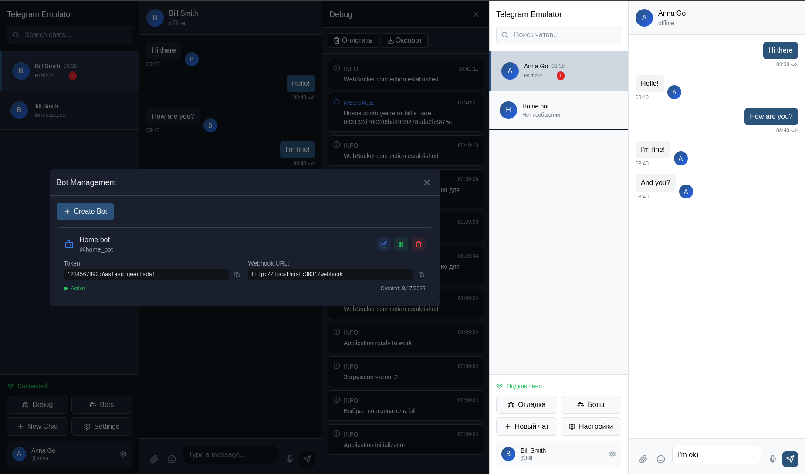

# Telegram Emulator

[English](README_EN.md) | Русский

[](https://github.com/positron48/telegram-emulator/actions)
[](https://github.com/positron48/telegram-emulator/actions)
[](https://golang.org/)
[](https://nodejs.org/)
[](LICENSE)
[](https://goreportcard.com/report/github.com/positron48/telegram-emulator)
[](https://codecov.io/gh/positron48/telegram-emulator)

Веб-эмулятор Telegram для локального тестирования и разработки ботов. Эмулятор предоставляет графический интерфейс, имитирующий Telegram, и позволяет тестировать ботов без необходимости использования реального Telegram API.



## Технологии

### Backend


### Frontend


### DevOps & Tools


## Возможности

### Реализовано
- **Telegram Bot API** - совместимый с официальным API
- **Веб-интерфейс** - похожий на Telegram
- **Управление ботами** - создание, редактирование, активация/деактивация
- **Система чатов** - приватные и групповые чаты
- **Отправка сообщений** - текстовые сообщения между пользователями
- **Получение обновлений** - боты получают обновления через polling и webhook
- **Long Polling** - поддержка timeout до 30 секунд
- **Webhook поддержка** - автоматическая отправка обновлений на сервер бота
- **Отправка сообщений через ботов** - боты могут отвечать на сообщения
- **Поддержка клавиатур** - обычные и inline клавиатуры с кнопками
- **WebSocket поддержка** - real-time обновления интерфейса
- **База данных SQLite** - хранение всех данных
- **Интерактивный Python бот** - с выбором режима работы (api, long polling, webhook)
- **Панель отладки** - мониторинг событий и состояния системы

### Telegram Bot API методы

Эмулятор поддерживает следующие методы Telegram Bot API:

#### Основные методы
- `getMe` - получение информации о боте
- `getUpdates` - получение обновлений
- `sendMessage` - отправка сообщения
- `setWebhook` - установка webhook
- `deleteWebhook` - удаление webhook
- `getWebhookInfo` - информация о webhook

#### Поддерживаемые типы обновлений
- Сообщения (`message`)
- Отредактированные сообщения (`edited_message`)
- Callback queries (`callback_query`)
- Inline queries (`inline_query`)
- И другие типы обновлений

## Установка и запуск

### Требования
- Go 1.23+
- Node.js 18+
- SQLite

### Быстрый старт

1. **Клонирование репозитория**
   ```bash
   git clone <repository-url>
   cd telegram-emulator
   ```

2. **Запуск эмулятора**
   ```bash
   make run
   ```

3. **Открытие веб-интерфейса**
   ```
   http://localhost:3001
   ```

### Ручная установка

1. **Backend (Go)**
   ```bash
   cd cmd/emulator
   go run main.go
   ```

2. **Frontend (React)**
   ```bash
   cd web
   npm install
   npm run dev
   ```

## Создание и тестирование ботов

### 1. Создание бота через веб-интерфейс

1. Откройте http://localhost:3001
2. Перейдите в раздел "Управление ботами"
3. Нажмите "Создать бота"
4. Заполните форму:
   - **Имя**: Test Bot
   - **Username**: test_bot
   - **Токен**: 1234567890:ABCdefGHIjklMNOpqrsTUVwxyz

### 2. Тестирование через API

#### Получение информации о боте
```bash
curl "http://localhost:3001/bot1234567890:ABCdefGHIjklMNOpqrsTUVwxyz/getMe"
```

#### Получение обновлений
```bash
curl "http://localhost:3001/bot1234567890:ABCdefGHIjklMNOpqrsTUVwxyz/getUpdates"
```

#### Отправка сообщения
```bash
curl -X POST "http://localhost:3001/bot1234567890:ABCdefGHIjklMNOpqrsTUVwxyz/sendMessage" \
  -H "Content-Type: application/json" \
  -d '{"chat_id": "2773246093156", "text": "Привет!"}'
```

#### Отправка сообщения с клавиатурой
```bash
curl -X POST "http://localhost:3001/bot1234567890:ABCdefGHIjklMNOpqrsTUVwxyz/sendMessage" \
  -H "Content-Type: application/json" \
  -d '{
    "chat_id": "2773246093156", 
    "text": "Выберите действие:",
    "reply_markup": {
      "keyboard": [
        [{"text": "ℹ️ Информация"}, {"text": "🔧 Настройки"}],
        [{"text": "📊 Статистика"}, {"text": "❓ Помощь"}]
      ],
      "resize_keyboard": true
    }
  }'
```

#### Отправка сообщения с inline клавиатурой
```bash
curl -X POST "http://localhost:3001/bot1234567890:ABCdefGHIjklMNOpqrsTUVwxyz/sendMessage" \
  -H "Content-Type: application/json" \
  -d '{
    "chat_id": "2773246093156", 
    "text": "Выберите действие:",
    "reply_markup": {
      "inline_keyboard": [
        [{"text": "🔍 Поиск", "callback_data": "search"}],
        [{"text": "🌐 Сайт", "url": "https://example.com"}]
      ]
    }
  }'
```

### 3. Интерактивный Python бот

Готовый к использованию бот с выбором режима работы:

```bash
cd examples
python simple_bot.py
```

#### Режимы работы:
- **Polling** - обычный режим с запросами каждую секунду
- **Long Polling** - эффективный режим с timeout 30 секунд
- **Webhook** - режим с встроенным Flask сервером

#### Особенности:
- Автоматическое сохранение состояния между запусками
- Встроенный webhook сервер с автоматической настройкой
- Поддержка всех режимов Telegram Bot API
- Graceful shutdown с очисткой webhook
- Демонстрация клавиатур (обычные и inline)

#### Команды бота:
- `/start` - Начать с клавиатурой
- `/help` - Показать справку
- `/keyboard` - Показать обычную клавиатуру
- `/inline` - Показать inline клавиатуру
- `/echo <текст>` - Эхо сообщения

Подробнее см. [examples/README.md](examples/README.md)

### 4. Тестирование полного цикла

1. **Создайте пользователя и чат**
   ```bash
   # Создание пользователя
   curl -X POST http://localhost:3001/api/users \
     -H "Content-Type: application/json" \
     -d '{"username": "testuser", "first_name": "Test", "last_name": "User"}'
   
   # Создание чата
   curl -X POST http://localhost:3001/api/chats \
     -H "Content-Type: application/json" \
     -d '{"type": "private", "title": "Test Chat", "user_ids": ["USER_ID"]}'
   ```

2. **Отправьте сообщение в чат**
   ```bash
   curl -X POST http://localhost:3001/api/chats/CHAT_ID/messages \
     -H "Content-Type: application/json" \
     -d '{"text": "Привет, бот!", "from_user_id": "USER_ID"}'
   ```

3. **Запустите бота**
   ```bash
   python bot.py
   ```

4. **Проверьте ответы бота в веб-интерфейсе**

## Структура проекта

```
telegram-emulator/
├── cmd/emulator/          # Точка входа приложения
├── internal/
│   ├── api/              # HTTP API и Telegram Bot API
│   ├── emulator/         # Основная логика эмулятора
│   ├── models/           # Модели данных
│   ├── repository/       # Слой доступа к данным
│   ├── websocket/        # WebSocket сервер
│   └── pkg/              # Общие пакеты
├── web/                  # React фронтенд
├── examples/             # Примеры ботов
├── configs/              # Конфигурационные файлы
└── migrations/           # Миграции базы данных
```

## Конфигурация

Основные настройки в `configs/config.yaml`:

```yaml
emulator:
  port: 3001
  host: localhost
  debug: true

database:
  url: sqlite:///data/emulator.db
  max_connections: 10

websocket:
  heartbeat_interval: 30s
  max_connections: 1000

bots:
  webhook_timeout: 30s
  max_connections: 100

logging:
  level: debug
  format: console
```

## Тестирование

### Запуск тестов
```bash
make test
```

### Тестирование API
```bash
# Тест интерактивного бота
cd examples
python simple_bot.py

# Тест веб-интерфейса
open http://localhost:3001

# Проверка производительности long polling
curl "http://localhost:3001/bot1234567890:ABCdefGHIjklMNOpqrsTUVwxyz/getUpdates?timeout=30"

# Проверка webhook (запустите бота в режиме webhook)
curl "http://localhost:3001/bot1234567890:ABCdefGHIjklMNOpqrsTUVwxyz/getWebhookInfo"
```

## Документация

- [Спецификация](TELEGRAM_EMULATOR_SPECIFICATION.md) - полная техническая спецификация
- [Пример бота](examples/) - пример использования

## Статистика проекта

### Тестирование


### Качество кода


### Размер проекта
- **Backend**: ~15,000 строк кода
- **Frontend**: ~5,000 строк кода
- **Тесты**: ~3,000 строк кода
- **Документация**: ~2,000 строк

---

**Статус**: Готов к использованию | **Версия**: v1.1

Telegram Emulator предоставляет полноценную среду для тестирования и разработки Telegram ботов с совместимым API и удобным веб-интерфейсом.
