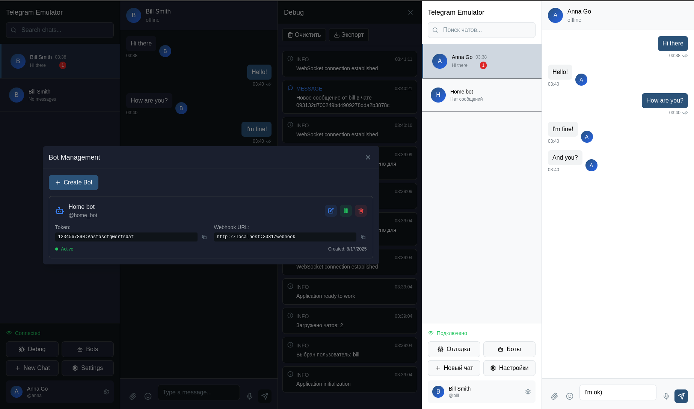

# Telegram Emulator

English | [Русский](README.md)

[](https://github.com/positron48/telegram-emulator/actions)
[](https://github.com/positron48/telegram-emulator/actions)
[](https://golang.org/)
[](https://nodejs.org/)
[](LICENSE)
[](https://goreportcard.com/report/github.com/positron48/telegram-emulator)
[](https://codecov.io/gh/positron48/telegram-emulator)

A web-based Telegram emulator for local bot testing and development. The emulator provides a graphical interface that mimics Telegram and allows you to test bots without using the real Telegram API.



## Technologies

### Backend


### Frontend


### DevOps & Tools


## Features

### Implemented
- **Telegram Bot API** - compatible with the official API
- **Web Interface** - similar to Telegram
- **Bot Management** - create, edit, activate/deactivate bots
- **Chat System** - private and group chats
- **Message Sending** - text messages between users
- **Update Retrieval** - bots receive updates via polling and webhook
- **Long Polling** - support for timeouts up to 30 seconds
- **Webhook Support** - automatic update delivery to bot servers
- **Bot Message Sending** - bots can reply to messages
- **WebSocket Support** - real-time interface updates
- **SQLite Database** - stores all data
- **Interactive Python Bot** - with mode selection (api, long polling, webhook)
- **Debug Panel** - monitoring events and system state
- **Keyboard Support** - ReplyKeyboardMarkup and InlineKeyboardMarkup
- **Callback Queries** - full support for inline keyboard interactions

### Telegram Bot API Methods

The emulator supports the following Telegram Bot API methods:

#### Core Methods
- `getMe` - get bot information
- `getUpdates` - get updates
- `sendMessage` - send message with keyboards
- `setWebhook` - set webhook
- `deleteWebhook` - delete webhook
- `getWebhookInfo` - get webhook information
- `answerCallbackQuery` - answer callback queries
- `editMessageText` - edit message text and inline keyboards

#### Supported Update Types
- Messages (`message`)
- Edited messages (`edited_message`)
- Callback queries (`callback_query`)
- Inline queries (`inline_query`)
- And other update types

## Installation and Setup

### Requirements
- Go 1.23+
- Node.js 18+
- SQLite

### Quick Start

1. **Clone the repository**
   ```bash
   git clone <repository-url>
   cd telegram-emulator
   ```

2. **Run the emulator**
   ```bash
   make run
   ```

3. **Open the web interface**
   ```
   http://localhost:3001
   ```

### Manual Installation

1. **Backend (Go)**
   ```bash
   cd cmd/emulator
   go run main.go
   ```

2. **Frontend (React)**
   ```bash
   cd web
   npm install
   npm run dev
   ```

## Creating and Testing Bots

### 1. Creating a Bot via Web Interface

1. Open http://localhost:3001
2. Go to "Bot Management" section
3. Click "Create Bot"
4. Fill out the form:
   - **Name**: Test Bot
   - **Username**: test_bot
   - **Token**: 1234567890:ABCdefGHIjklMNOpqrsTUVwxyz

### 2. Testing via API

#### Get Bot Information
```bash
curl "http://localhost:3001/bot1234567890:ABCdefGHIjklMNOpqrsTUVwxyz/getMe"
```

#### Get Updates
```bash
curl "http://localhost:3001/bot1234567890:ABCdefGHIjklMNOpqrsTUVwxyz/getUpdates"
```

#### Send Message
```bash
curl -X POST "http://localhost:3001/bot1234567890:ABCdefGHIjklMNOpqrsTUVwxyz/sendMessage" \
  -H "Content-Type: application/json" \
  -d '{"chat_id": "2773246093156", "text": "Hello!"}'
```

#### Send Message with Reply Keyboard
```bash
curl -X POST "http://localhost:3001/bot1234567890:ABCdefGHIjklMNOpqrsTUVwxyz/sendMessage" \
  -H "Content-Type: application/json" \
  -d '{
    "chat_id": "2773246093156", 
    "text": "Choose an option:",
    "reply_markup": {
      "keyboard": [
        [{"text": "Option 1"}, {"text": "Option 2"}],
        [{"text": "Option 3"}]
      ],
      "resize_keyboard": true,
      "one_time_keyboard": false
    }
  }'
```

#### Send Message with Inline Keyboard
```bash
curl -X POST "http://localhost:3001/bot1234567890:ABCdefGHIjklMNOpqrsTUVwxyz/sendMessage" \
  -H "Content-Type: application/json" \
  -d '{
    "chat_id": "2773246093156", 
    "text": "Choose an action:",
    "reply_markup": {
      "inline_keyboard": [
        [{"text": "Search", "callback_data": "search"}],
        [{"text": "Settings", "callback_data": "settings"}]
      ]
    }
  }'
```

### 3. Interactive Python Bot

Ready-to-use bot with mode selection:

```bash
cd examples
python simple_bot.py
```

#### Operating Modes:
- **Polling** - standard mode with requests every second
- **Long Polling** - efficient mode with 30-second timeout
- **Webhook** - mode with built-in Flask server

#### Features:
- Automatic state persistence between runs
- Built-in webhook server with automatic configuration
- Support for all Telegram Bot API modes
- Graceful shutdown with webhook cleanup
- Full keyboard support with commands:
  - `/start` - shows reply keyboard
  - `/help` - shows help information
  - `/keyboard` - shows reply keyboard
  - `/inline` - shows inline keyboard with callback queries

For more details, see [examples/README.md](examples/README.md)

### 4. Full Cycle Testing

1. **Create a user and chat**
   ```bash
   # Create user
   curl -X POST http://localhost:3001/api/users \
     -H "Content-Type: application/json" \
     -d '{"username": "testuser", "first_name": "Test", "last_name": "User"}'
   
   # Create chat
   curl -X POST http://localhost:3001/api/chats \
     -H "Content-Type: application/json" \
     -d '{"type": "private", "title": "Test Chat", "user_ids": ["USER_ID"]}'
   ```

2. **Send a message to the chat**
   ```bash
   curl -X POST http://localhost:3001/api/chats/CHAT_ID/messages \
     -H "Content-Type: application/json" \
     -d '{"text": "Hello, bot!", "from_user_id": "USER_ID"}'
   ```

3. **Run the bot**
   ```bash
   python bot.py
   ```

4. **Check bot responses in the web interface**

## Project Structure

```
telegram-emulator/
├── cmd/emulator/          # Application entry point
├── internal/
│   ├── api/              # HTTP API and Telegram Bot API
│   ├── emulator/         # Core emulator logic
│   ├── models/           # Data models
│   ├── repository/       # Data access layer
│   ├── websocket/        # WebSocket server
│   └── pkg/              # Common packages
├── web/                  # React frontend
├── examples/             # Bot examples
├── configs/              # Configuration files
└── migrations/           # Database migrations
```

## Configuration

Main settings in `configs/config.yaml`:

```yaml
emulator:
  port: 3001
  host: localhost
  debug: true

database:
  url: sqlite:///data/emulator.db
  max_connections: 10

websocket:
  heartbeat_interval: 30s
  max_connections: 1000

bots:
  webhook_timeout: 30s
  max_connections: 100

logging:
  level: debug
  format: console
```

## Testing

### Running Tests
```bash
make test
```

### API Testing
```bash
# Test interactive bot
cd examples
python simple_bot.py

# Test web interface
open http://localhost:3001

# Check long polling performance
curl "http://localhost:3001/bot1234567890:ABCdefGHIjklMNOpqrsTUVwxyz/getUpdates?timeout=30"

# Check webhook (run bot in webhook mode)
curl "http://localhost:3001/bot1234567890:ABCdefGHIjklMNOpqrsTUVwxyz/getWebhookInfo"
```

## Documentation

- [Specification](TELEGRAM_EMULATOR_SPECIFICATION.md) - complete technical specification
- [Bot Example](examples/) - usage example

## Project Statistics

### Testing


### Code Quality


### Project Size
- **Backend**: ~15,000 lines of code
- **Frontend**: ~5,000 lines of code
- **Tests**: ~3,000 lines of code
- **Documentation**: ~2,000 lines

---

**Status**: Ready to use | **Version**: v1.1

Telegram Emulator provides a complete environment for testing and developing Telegram bots with a compatible API and convenient web interface.
