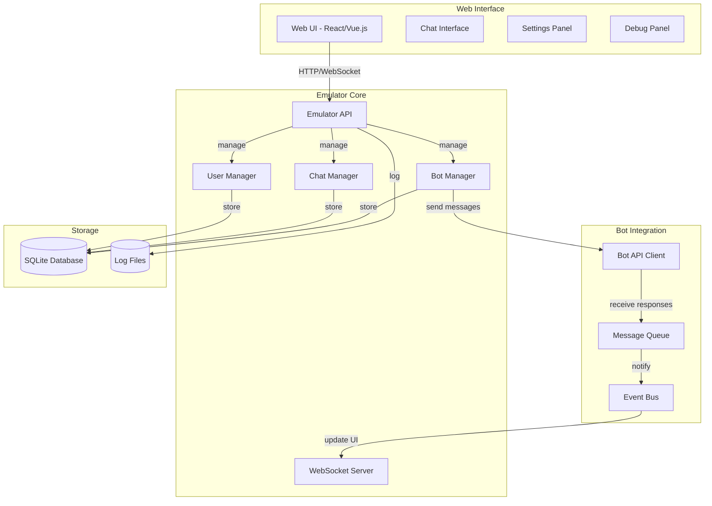

# Telegram Emulator - Спецификация

## 📋 Обзор проекта

Веб-эмулятор Telegram для локального тестирования и разработки ботов. Эмулятор предоставляет графический интерфейс, имитирующий Telegram, и позволяет тестировать ботов без необходимости использования реального Telegram API.

### 🎯 Цели проекта

- **Локальное тестирование** ботов без интернета
- **Визуальный интерфейс** похожий на Telegram
- **Полный контроль** над сообщениями и состояниями
- **Отладка** ботов с детальным логированием
- **Автоматизированное тестирование** через API
- **Мультипользовательское тестирование** с несколькими чатами

## 🏗️ Архитектура

### Высокоуровневая схема



### Компоненты системы

1. **Web Interface** - пользовательский интерфейс
2. **Emulator API** - REST API для управления эмулятором
3. **WebSocket Server** - real-time обновления
4. **Bot Manager** - управление ботами и их состояниями
5. **Chat Manager** - управление чатами и сообщениями
6. **User Manager** - управление пользователями
7. **Bot API Client** - клиент для взаимодействия с ботами
8. **Message Queue** - очередь сообщений
9. **Event Bus** - система событий

## 🔧 Технический стек

### Backend
- **Язык**: Go 1.23+
- **Web Framework**: Gin или Echo
- **WebSocket**: Gorilla WebSocket
- **База данных**: SQLite
- **ORM**: GORM
- **Логирование**: Zap/Zerolog
- **Конфигурация**: Viper

### Frontend
- **Framework**: React 18+ или Vue.js 3+
- **UI Library**: Tailwind CSS + Headless UI
- **State Management**: Zustand (React) или Pinia (Vue)
- **WebSocket**: Socket.io-client
- **Icons**: Heroicons или Lucide React

### Структура проекта
```
telegram-emulator/
├── cmd/
│   └── emulator/
│       └── main.go
├── internal/
│   ├── api/
│   │   ├── handlers/
│   │   ├── middleware/
│   │   └── routes.go
│   ├── emulator/
│   │   ├── bot_manager.go
│   │   ├── chat_manager.go
│   │   ├── user_manager.go
│   │   ├── message_queue.go
│   │   └── event_bus.go
│   ├── models/
│   │   ├── user.go
│   │   ├── chat.go
│   │   ├── message.go
│   │   └── bot.go
│   ├── repository/
│   │   ├── user_repo.go
│   │   ├── chat_repo.go
│   │   ├── message_repo.go
│   │   └── bot_repo.go
│   ├── websocket/
│   │   ├── server.go
│   │   ├── client.go
│   │   └── events.go
│   └── pkg/
│       ├── config/
│       ├── logger/
│       └── utils/
├── web/
│   ├── src/
│   │   ├── components/
│   │   ├── pages/
│   │   ├── stores/
│   │   └── utils/
│   ├── public/
│   └── package.json
├── migrations/
├── configs/
├── docker/
└── docs/
```

## 🎨 Пользовательский интерфейс

### Основной интерфейс

#### 1. **Боковая панель (Sidebar)**
```
┌─────────────────────────────────────┐
│ 🔍 Поиск чатов...                   │
├─────────────────────────────────────┤
│ 👤 Главный чат                      │
│ 👤 Тестовый пользователь 1          │
│ 👤 Тестовый пользователь 2          │
│ 👤 Группа "Тестовая группа"         │
├─────────────────────────────────────┤
│ ⚙️ Настройки                        │
│ 🐛 Отладка                          │
│ 📊 Статистика                       │
└─────────────────────────────────────┘
```

#### 2. **Область чата (Chat Area)**
```
┌─────────────────────────────────────┐
│ 👤 Тестовый пользователь 1          │
│ 📱 online                           │
├─────────────────────────────────────┤
│                                     │
│ 🤖 Привет! Я бот для учета...       │
│    12:34                            │
│                                     │
│ 👤 1000 продукты                    │
│    12:35                            │
│                                     │
│ 🤖 💰 Добавлена транзакция:         │
│    📅 15.12.2023                    │
│    💸 Расход: 1,000.00 ₽            │
│    🏷️ Категория: Питание            │
│    📝 Описание: продукты            │
│    12:35                            │
│                                     │
├─────────────────────────────────────┤
│ 💬 Введите сообщение...             │
│ 📎 🎤 ➤                             │
└─────────────────────────────────────┘
```

#### 3. **Панель отладки (Debug Panel)**
```
┌─────────────────────────────────────┐
│ 🐛 Отладка                          │
├─────────────────────────────────────┤
│ 📋 Последние события:               │
│ 12:35:001 - Получено сообщение      │
│ 12:35:002 - Отправлен запрос к боту │
│ 12:35:003 - Получен ответ от бота   │
│ 12:35:004 - Сообщение отображено    │
├─────────────────────────────────────┤
│ 🔧 Действия:                        │
│ [ ] Очистить чат                    │
│ [ ] Сбросить бота                   │
│ [ ] Экспорт логов                   │
└─────────────────────────────────────┘
```

### Компоненты интерфейса

#### 1. **ChatList Component**
```typescript
interface ChatListProps {
  chats: Chat[];
  selectedChat: Chat | null;
  onChatSelect: (chat: Chat) => void;
  onNewChat: () => void;
}

interface Chat {
  id: string;
  type: 'private' | 'group';
  title: string;
  username?: string;
  lastMessage?: Message;
  unreadCount: number;
  isOnline: boolean;
}
```

#### 2. **ChatWindow Component**
```typescript
interface ChatWindowProps {
  chat: Chat;
  messages: Message[];
  onSendMessage: (text: string) => void;
  onSendFile: (file: File) => void;
  onSendVoice: (audio: Blob) => void;
}

interface Message {
  id: string;
  chatId: string;
  from: User;
  text: string;
  timestamp: Date;
  type: 'text' | 'file' | 'voice' | 'photo';
  status: 'sending' | 'sent' | 'delivered' | 'read';
  isOutgoing: boolean;
}
```

#### 3. **MessageInput Component**
```typescript
interface MessageInputProps {
  onSend: (text: string) => void;
  onTyping: (isTyping: boolean) => void;
  placeholder?: string;
  disabled?: boolean;
}
```

#### 4. **DebugPanel Component**
```typescript
interface DebugPanelProps {
  events: DebugEvent[];
  statistics: Statistics;
  onClearChat: () => void;
  onResetBot: () => void;
  onExportLogs: () => void;
}

interface DebugEvent {
  id: string;
  timestamp: Date;
  type: 'message' | 'api_call' | 'error' | 'info';
  description: string;
  data?: any;
}
```

## 🔌 API эмулятора

### REST API

#### 1. **Управление пользователями**
```http
# Создание пользователя
POST /api/users
{
  "username": "test_user",
  "firstName": "Test",
  "lastName": "User",
  "isBot": false
}

# Получение списка пользователей
GET /api/users

# Обновление пользователя
PUT /api/users/{id}
{
  "firstName": "Updated",
  "lastName": "Name"
}

# Удаление пользователя
DELETE /api/users/{id}
```

#### 2. **Управление чатами**
```http
# Создание чата
POST /api/chats
{
  "type": "private",
  "title": "Test Chat",
  "userIds": ["user1", "user2"]
}

# Получение чатов пользователя
GET /api/users/{userId}/chats

# Получение сообщений чата
GET /api/chats/{chatId}/messages?limit=50&offset=0
```

#### 3. **Управление сообщениями**
```http
# Отправка сообщения
POST /api/chats/{chatId}/messages
{
  "text": "Hello, bot!",
  "fromUserId": "user1",
  "type": "text"
}

# Получение сообщения
GET /api/messages/{messageId}

# Обновление статуса сообщения
PUT /api/messages/{messageId}/status
{
  "status": "read"
}
```

#### 4. **Управление ботами**
```http
# Регистрация бота
POST /api/bots
{
  "name": "Test Bot",
  "username": "test_bot",
  "token": "1234567890:ABCdefGHIjklMNOpqrsTUVwxyz",
  "webhookUrl": "http://localhost:8080/webhook"
}

# Получение информации о боте
GET /api/bots/{botId}

# Обновление настроек бота
PUT /api/bots/{botId}
{
  "webhookUrl": "http://localhost:8080/new-webhook"
}
```

### WebSocket API

#### 1. **Подключение**
```javascript
const socket = new WebSocket('ws://localhost:3001/ws');

socket.onopen = () => {
  console.log('Connected to emulator');
  
  // Подписка на события
  socket.send(JSON.stringify({
    type: 'subscribe',
    events: ['message', 'user_update', 'chat_update']
  }));
};
```

#### 2. **События**
```typescript
// Новое сообщение
{
  type: 'message',
  data: {
    id: 'msg_123',
    chatId: 'chat_456',
    from: { id: 'user_789', username: 'test_user' },
    text: 'Hello, bot!',
    timestamp: '2023-12-15T12:34:56Z',
    isOutgoing: false
  }
}

// Обновление пользователя
{
  type: 'user_update',
  data: {
    id: 'user_789',
    isOnline: true,
    lastSeen: '2023-12-15T12:34:56Z'
  }
}

// Обновление чата
{
  type: 'chat_update',
  data: {
    id: 'chat_456',
    unreadCount: 5,
    lastMessage: { text: 'Hello!', timestamp: '2023-12-15T12:34:56Z' }
  }
}
```

## 🤖 Интеграция с ботами

### Webhook интеграция

#### 1. **Получение webhook от бота**
```http
POST /api/webhook/{botId}
{
  "update_id": 123456789,
  "message": {
    "message_id": 1,
    "from": {
      "id": 123456789,
      "is_bot": false,
      "first_name": "Test",
      "username": "test_user"
    },
    "chat": {
      "id": 123456789,
      "first_name": "Test",
      "username": "test_user",
      "type": "private"
    },
    "date": 1702641296,
    "text": "Hello, bot!"
  }
}
```

#### 2. **Отправка ответа боту**
```http
POST /api/bots/{botId}/sendMessage
{
  "chat_id": 123456789,
  "text": "Hello! I'm a bot.",
  "parse_mode": "HTML"
}
```

### Прямая интеграция

#### 1. **Подключение бота к эмулятору**
```go
type BotClient struct {
    emulatorURL string
    botID       string
    httpClient  *http.Client
}

func (bc *BotClient) Connect() error {
    // Регистрация бота в эмуляторе
    resp, err := bc.httpClient.Post(
        bc.emulatorURL+"/api/bots",
        "application/json",
        bytes.NewBuffer([]byte(`{
            "name": "Test Bot",
            "username": "test_bot",
            "token": "1234567890:ABCdefGHIjklMNOpqrsTUVwxyz"
        }`)),
    )
    
    if err != nil {
        return err
    }
    
    // Получение botID
    var result struct {
        ID string `json:"id"`
    }
    json.NewDecoder(resp.Body).Decode(&result)
    bc.botID = result.ID
    
    return nil
}
```

#### 2. **Получение обновлений**
```go
func (bc *BotClient) GetUpdates() ([]Update, error) {
    resp, err := bc.httpClient.Get(
        bc.emulatorURL + "/api/bots/" + bc.botID + "/updates",
    )
    
    if err != nil {
        return nil, err
    }
    
    var updates []Update
    json.NewDecoder(resp.Body).Decode(&updates)
    return updates, nil
}
```

## 📊 Модели данных

### 1. **User Model**
```go
type User struct {
    ID        string    `json:"id" gorm:"primaryKey"`
    Username  string    `json:"username" gorm:"uniqueIndex"`
    FirstName string    `json:"first_name"`
    LastName  string    `json:"last_name"`
    IsBot     bool      `json:"is_bot"`
    IsOnline  bool      `json:"is_online"`
    LastSeen  time.Time `json:"last_seen"`
    CreatedAt time.Time `json:"created_at"`
    UpdatedAt time.Time `json:"updated_at"`
}
```

### 2. **Chat Model**
```go
type Chat struct {
    ID          string    `json:"id" gorm:"primaryKey"`
    Type        string    `json:"type"` // private, group
    Title       string    `json:"title"`
    Username    string    `json:"username"`
    Description string    `json:"description"`
    Members     []User    `json:"members" gorm:"many2many:chat_members;"`
    LastMessage *Message  `json:"last_message" gorm:"foreignKey:ChatID"`
    UnreadCount int       `json:"unread_count"`
    CreatedAt   time.Time `json:"created_at"`
    UpdatedAt   time.Time `json:"updated_at"`
}
```

### 3. **Message Model**
```go
type Message struct {
    ID        string    `json:"id" gorm:"primaryKey"`
    ChatID    string    `json:"chat_id"`
    FromID    string    `json:"from_id"`
    From      User      `json:"from" gorm:"foreignKey:FromID"`
    Text      string    `json:"text"`
    Type      string    `json:"type"` // text, file, voice, photo
    Status    string    `json:"status"` // sending, sent, delivered, read
    IsOutgoing bool     `json:"is_outgoing"`
    Timestamp time.Time `json:"timestamp"`
    CreatedAt time.Time `json:"created_at"`
}
```

### 4. **Bot Model**
```go
type Bot struct {
    ID         string    `json:"id" gorm:"primaryKey"`
    Name       string    `json:"name"`
    Username   string    `json:"username" gorm:"uniqueIndex"`
    Token      string    `json:"token"`
    WebhookURL string    `json:"webhook_url"`
    IsActive   bool      `json:"is_active"`
    CreatedAt  time.Time `json:"created_at"`
    UpdatedAt  time.Time `json:"updated_at"`
}
```

## 🎮 Функции эмулятора

### 1. **Базовые функции**
- ✅ Создание и управление пользователями
- ✅ Создание и управление чатами
- ✅ Отправка и получение сообщений
- ✅ Эмуляция статусов сообщений
- ✅ Эмуляция онлайн/оффлайн статусов

### 2. **Продвинутые функции**
- ✅ Webhook интеграция с ботами
- ✅ Прямая интеграция через API
- ✅ Эмуляция задержек сети
- ✅ Эмуляция ошибок сети
- ✅ Эмуляция различных типов сообщений

### 3. **Отладочные функции**
- ✅ Детальное логирование всех событий
- ✅ Статистика производительности
- ✅ Экспорт логов
- ✅ Визуализация API вызовов
- ✅ Мониторинг состояния ботов

### 4. **Тестовые функции**
- ✅ Автоматическая отправка сообщений
- ✅ Создание тестовых сценариев
- ✅ Нагрузочное тестирование
- ✅ Эмуляция множественных пользователей
- ✅ Эмуляция групповых чатов

## 🚀 План разработки

### Этап 1: Базовая инфраструктура (1 неделя)
1. Настройка проекта и зависимостей
2. Создание моделей данных
3. Настройка базы данных
4. Базовый REST API

### Этап 2: WebSocket и UI (1 неделя)
1. WebSocket сервер
2. Базовый веб-интерфейс
3. Компоненты чата
4. Real-time обновления

### Этап 3: Интеграция с ботами (1 неделя)
1. Webhook поддержка
2. Прямая интеграция через API
3. Эмуляция Telegram Bot API
4. Тестирование с реальными ботами

### Этап 4: Продвинутые функции (1 неделя)
1. Отладочная панель
2. Тестовые сценарии
3. Документация

## 📋 Команды для запуска

### Локальная разработка
```bash
# Запуск эмулятора
make dev

# Запуск только backend
make run-backend

# Запуск только frontend
make run-frontend

# Тесты
make test

# Сборка
make build
```

### Docker
```bash
# Запуск с Docker Compose
docker-compose up -d

# Остановка
docker-compose down

# Пересборка
docker-compose up --build
```

## 🔧 Конфигурация

### Переменные окружения
```bash
# Основные настройки
EMULATOR_PORT=3001
EMULATOR_HOST=localhost
DATABASE_URL=sqlite:///data/emulator.db

# Настройки ботов
BOT_WEBHOOK_TIMEOUT=30s
BOT_MAX_CONNECTIONS=100

# Настройки логирования
LOG_LEVEL=debug
LOG_FORMAT=console

# Настройки WebSocket
WS_HEARTBEAT_INTERVAL=30s
WS_MAX_CONNECTIONS=1000
```

### Конфигурационный файл
```yaml
# configs/config.yaml
emulator:
  port: 3001
  host: localhost
  debug: true

database:
  url: sqlite:///data/emulator.db
  max_connections: 10

websocket:
  heartbeat_interval: 30s
  max_connections: 1000

bots:
  webhook_timeout: 30s
  max_connections: 100

logging:
  level: debug
  format: console
  file: logs/emulator.log
```

---

**Статус документа**: 📋 Готов к реализации

Данная спецификация содержит полное техническое задание для создания эмулятора Telegram с веб-интерфейсом для тестирования и разработки ботов.
